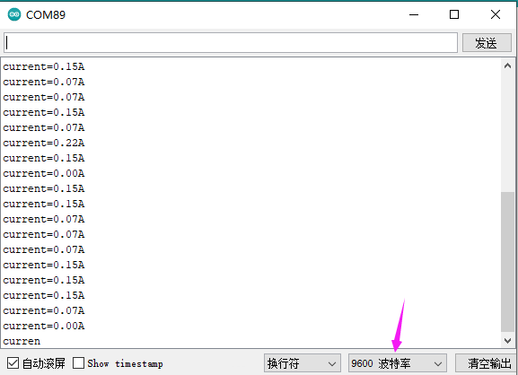

# Arduino


## 1. Arduino简介  

Arduino是一种开源电子原型平台，旨在帮助初学者和爱好者通过简单的硬件与软件来学习电子与编程概念。Arduino开发板支持多种传感器与模块，通过简单的编程，用户能够创建互动项目，增强创造力与技术能力。它的编程语言基于C/C++，配合强大而友好的社区资源与教程，使得任何人都能轻松入门，从而实现各种电子项目。  

## 2. 接线图  

| UNO开发板           | 电流检测传感器 |  
|-----------------|--------------|  
| 5V              | V            |  
| GND             | G            |  
| A0              | S            |  

  

## 3. 示例代码  

```arduino  
int temp;  
void setup() {  
  // initialize serial communication at 9600 bits per second:  
  Serial.begin(9600);  
}  

// the loop routine runs over and over again forever:  
void loop() {  
  // read the input on analog pin 0:  
  float current = analogRead(A0);  
  temp = current;  
  temp = temp - 512;  
  current = temp / 13.6;  
  
  // print out the value you read:  
  Serial.print("current=");  
  Serial.print(current);  
  Serial.println("A");  
  delay(300); // delay in between reads for stability  
}  
```  

## 4. 结果  

如上接好线，上传程序。接通电源后，打开串口监视器设置波特率为9600，该传感器上的指示灯亮起，显示所示的电流强度。  




