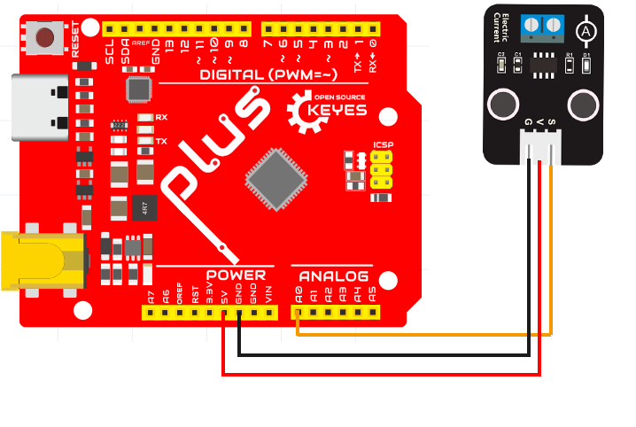
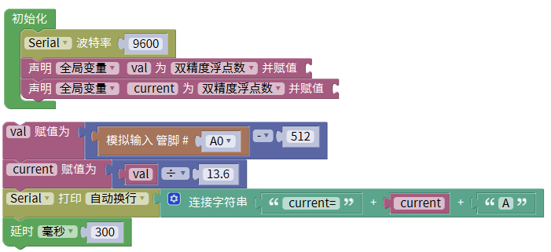
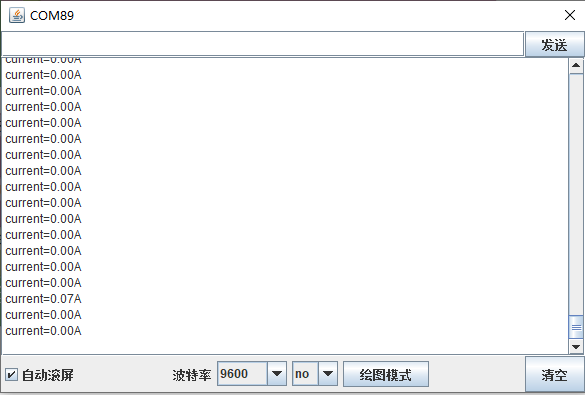

# Mixly

## 1. Mixly简介  

Mixly是一款基于Scratch编程思想和Arduino环境的可视化编程平台，旨在降低编程的门槛，使初学者和青少年更容易接触和学习编程与电子。用户可以通过拖拽模块来创建程序，Mixly为Arduino提供了丰富的功能模块，涵盖传感器、控制器、执行器等多种元件。通过Mixly，用户无需深入掌握复杂的代码语法即可实现各种电子项目，鼓励创造与实践。  

## 2. 接线图  

| UNO开发板           | 电流检测传感器 |  
|-----------------|--------------|  
| 5V              | V            |  
| GND             | G            |  
| A0              | S            |  

  

## 3. 示例代码  

  

## 4. 结果  

如上接好线，上传程序。接通电源后，打开串口监视器设置波特率为9600，该传感器上的指示灯亮起，显示所示的电流强度。  

